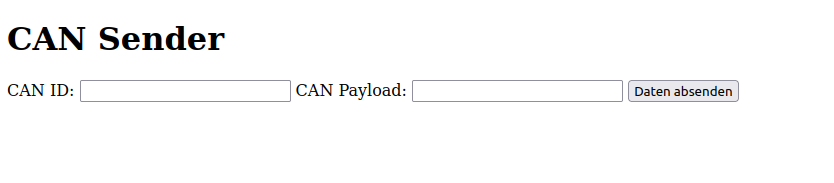

# Go CAN Example

This is a sample CAN snap written with [Go](https://go.dev/). 

It demonstrates how a snap can interact with the CAN reading two messages from can1.
Subsequently, the snap writes back a new message to can1.
The new message contains the merged payload (bitwise OR is applied) of both received messages.

## Setup and Build

For building and installing the snap a certain build environment needs to be set up.
It is recommended to use a Raspberry Pi 3 as a build computer.

### Raspberry Pi

The Raspberry Pi (RasPi) should run a 32-bit Ubuntu 18. Specifically, we
recommend [ubuntu-18.04.4-preinstalled-server-armhf+raspi3.img.xz](http://old-releases.ubuntu.com/releases/18.04.4/ubuntu-18.04.4-preinstalled-server-armhf+raspi3.img.xz)
from the [Ubuntu release archive](http://old-releases.ubuntu.com/releases/18.04.4/). 
Flash it onto the RasPi's SD card using a tool of your choice (e.g. [Rufus](https://rufus.ie/) (recommended)
or [Balena Etcher](https://www.balena.io/etcher/)).

Subsequently, plug the card in the RasPi and boot it (default credentials should be `user: ubuntu`
and `password: ubuntu`).
[Set up wifi](https://netplan.io/examples/) or plug the RasPi into your router via ethernet. 
Before building the snap, you need to install snapcraft as follows.

```
sudo snap install snapcraft --classic
```

### Build

For compilation the Go compiler needs to be installed (see the [official documentation](https://go.dev/)).

The build computer is now ready to compile your snap.
Just copy the whole snap folder [can-demo-golang](.) onto the build computer.
Then just run the build script [`build.sh`](build.sh).

```
bash build.sh
```

After successful execution, there will be the resulting
snap [can-demo_0.2.0_armhf.snap](can-demo_0.2.0_armhf.snap).
You can now copy it onto the RCU and install it.

```
snap install can-demo_0.2.0_armhf.snap --dangerous
```

### Notes on Build Setup

The go code needs to be cross-compiled for the RCU's armhf processor.
Hence, the `go build` command is called with the env variables `GOOS=linux GOARCH=arm` (see [`build.sh`](build.sh)).

In order to avoid snapcraft mounting a multipass VM for building, the host has to be set as build environment.
This is done by the following line within [`build.sh`](build.sh).

``` 
export SNAPCRAFT_BUILD_ENVIRONMENT=host
```

## Content

The following section briefly explains the content of this sample.
The sample is a minimal working example not handling all possible errors.
It does not represent a production-grade project.

The file [`cmd/can-demo/can-demo.go`](cmd/can-demo/can-demo.go) represents the entry point calling all other functions.
Further, the actual business logic resides in [`pkg/can/can.go`](pkg/can/can.go).

The file [`cmd/frontend/frontend.go`](cmd/frontend/frontend.go) represents the entry point for the frontend.
The frontend's business logic resides in [`pkg/frontend/server.go`](pkg/frontend/server.go).

The snap is defined in [snap/snapcraft.yaml](snap/snapcraft.yaml). See comments for a few detail information about the
key instructions.

The file [build.sh](build.sh) is used to simplify building the snap.
It ensures that all necessary environment variables and parameters are set.
Eventually, it cleans possibly remaining build artifacts and starts a new build.

In [go.mod](go.mod), some meta information about the project and its dependencies are given.

## Usage

Once the snap is installed on the RCU, it automatically starts.
Check its status with the following command.

```
snap info can-demo
```

Review its logs (the optional `-f` let's you keep listening to the logs, exit with `Ctrl` + `C`).

```
snap logs can-demo [-f]
```

Test the functionality by sending CAN messages on can1, e.g.:

```
can1 001#8899AABBCCDDEEFF
```

The snap will invert the payload and return a new message on can1.

```
can1 001#FFEEDDCCBBAA9988
```

If you would like to uninstall the snap again, you can do so like below.

```
snap remove --purge can-demo
```

### Frontend

The frontend needs some tweaking of the RCU to work, due to the restrictive firewall of the RCU.
Therefore, drop all firewall rules and replace the default DROP by default ACCEPT on all chains.
Careful, this setting is only for development purposes.
For a productive application the firewall rules need to be thoroughly specified.
Also, after boot the RCU will re-apply the original default firewall rules.

```
iptables -P INPUT ACCEPT
iptables -P FORWARD ACCEPT
iptables -P OUTPUT ACCEPT
iptables -X
iptables -F
```

Subsequently, it is possible to access the frontend, when connected via Ethernet.
Just open a web browser of your choice and access the following resource.
The value `<rcu_ip>` should be replaced by the RCU's IP address.

```
http://<rcu_ip>:3000/
```

The browser should show the frontend as below.
By entering and submitting an ID and a CAN payload, the frontend will pass the values to the web server.
Hereafter, the webserver creates a CAN frame object and sends it via `can1` on the CAN bus.



## Copyright

The file [COPYRIGHT](COPYRIGHT) contains a comma-separated list of all dependencies and their licenses.
This list is auto-generated using [go-licenses](https://github.com/google/go-licenses) (see command below).

```
go-licenses csv ./...
```

Further, all dependency versions can be retrieved from [go.mod](go.mod).

## License

The license of the project is given in [LICENSE](LICENSE).
This file is also packed into the snap. After snap installation, it can be viewed from [/snap/can-demo/current/LICENSE](/snap/can-demo/current/LICENSE).
